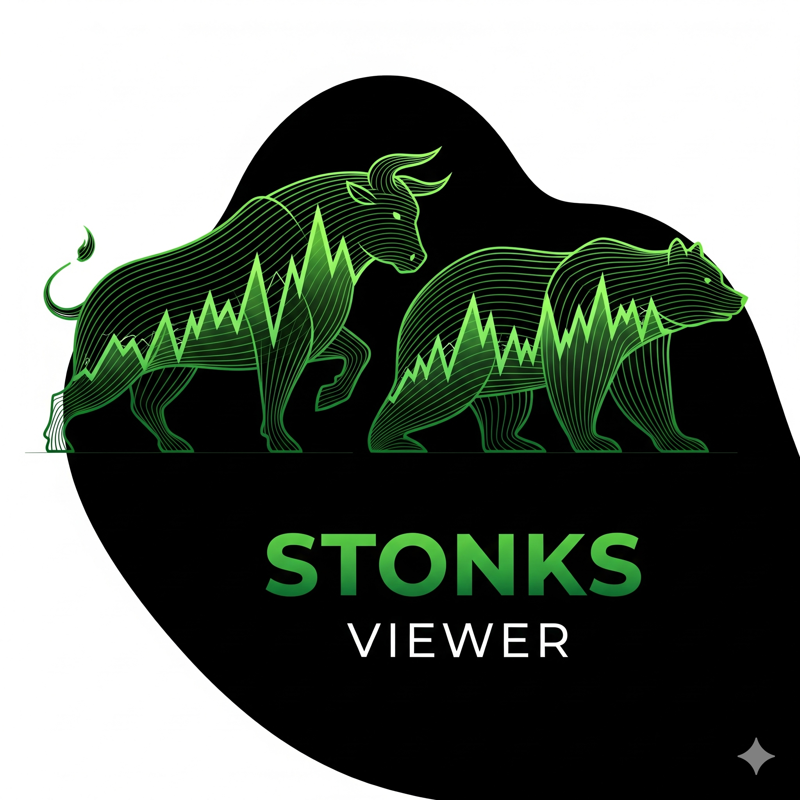

Stonks Viewer

Seu controle financeiro, de um jeito simples e prático.

💻 Sobre o Projeto
O Stonks Viewer é uma aplicação web simples e intuitiva, desenvolvida para ajudar o usuário a gerenciar sua vida financeira pessoal. Diferente de plataformas de investimento, nosso foco está em dar ao usuário o poder de controlar seu próprio dinheiro, permitindo registrar despesas, receitas, definir metas e acompanhar sua evolução, tudo de forma manual e segura.
Esta é a versão inicial do projeto, que não exige integração bancária, permitindo que o usuário tenha total autonomia sobre seus dados.

✨ Funcionalidades

As funcionalidades do Stonks Viewer foram definidas através de histórias de usuário, priorizadas para a primeira entrega:

Registro de Movimentações: Adicionar manualmente despesas e receitas.

Categorização: Categorizar gastos para uma melhor visualização.

Gerenciamento de Metas: Criar e editar metas de economia, como uma reserva de emergência ou objetivos de longo prazo.

Visualização de Dados: Acompanhar a saúde financeira através de gráficos e relatórios simples.

Histórico: Rever todas as movimentações financeiras para análise.

📋 Planejamento - Metodologia Kanban

Adotamos a metodologia Kanban para garantir um fluxo de trabalho contínuo e eficiente, focando em entregar valor de forma incremental.

Papéis do Time

Product Manager: Lucas Mendes - Responsável por gerenciar o backlog e as prioridades.

Time de Desenvolvimento: Lucas Mendes, Arthur, Lucas, Quezia Costa - Responsáveis pela execução das tarefas.

Designer UI/UX: Manuela Silveira - Responsável pelo controle de qualidade do site, direcionando o caminho que o desenvolvedor front-end deve seguir

Nosso Quadro Kanban (Trello) -> [trello](https://trello.com/b/AJuZFnzE/stonks-viewer)

Nosso fluxo de trabalho e as histórias de usuário estão visualmente organizados no nosso quadro Kanban.

🛠️ Tecnologias Utilizadas

Este projeto foi construído utilizando as seguintes tecnologias:

Frontend:

HTML5

CSS3

JavaScript

Backend:

?

Banco de Dados:

?
