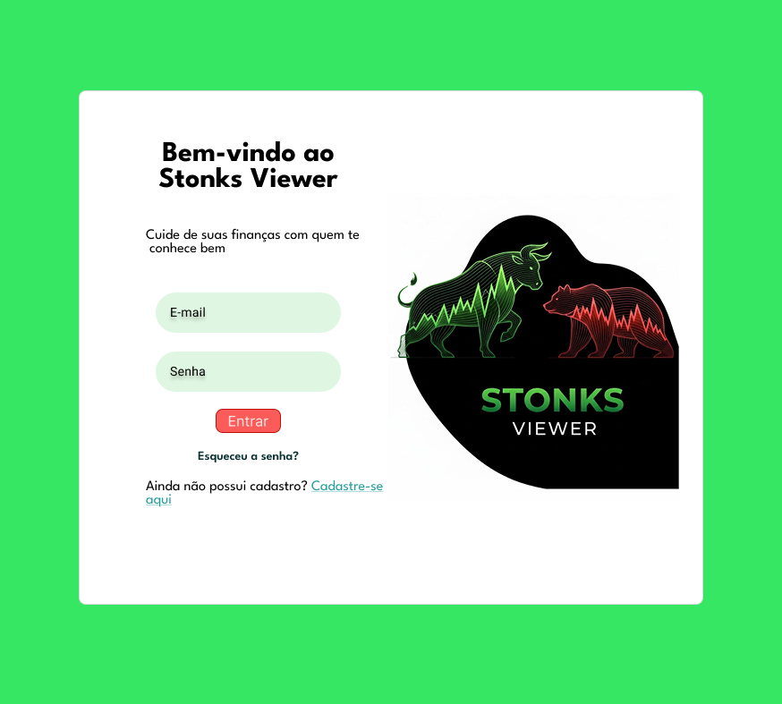
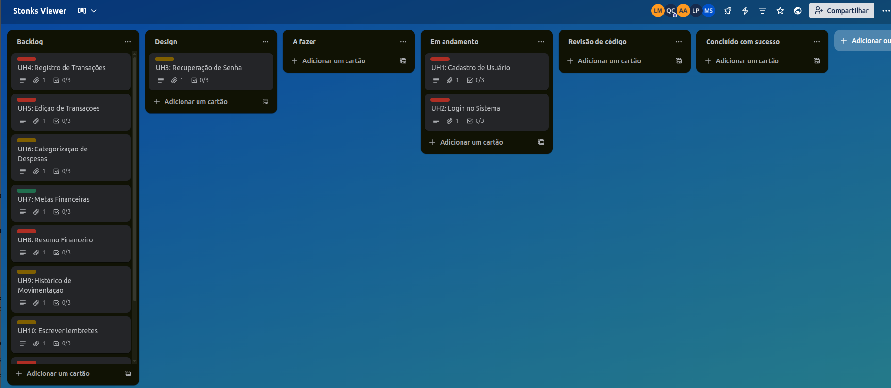
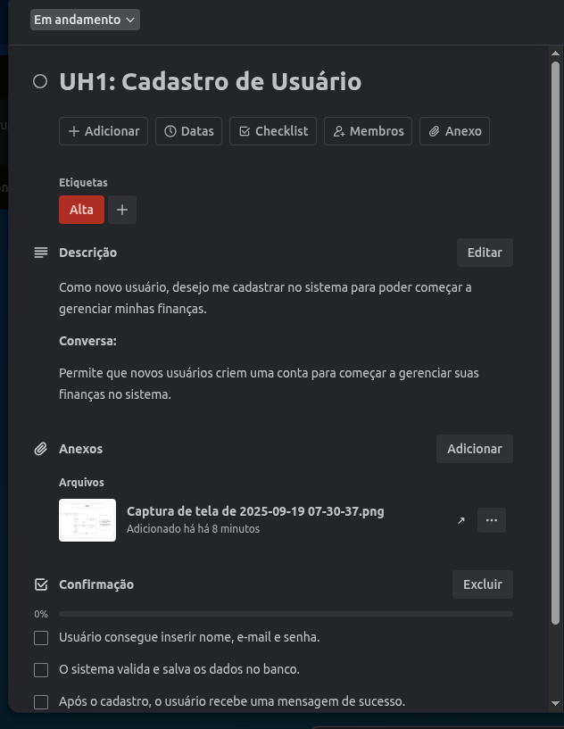

## Stonks Viewer
-

Seu controle financeiro, de um jeito simples e prático.

---

## 💻 Sobre o Projeto

O Stonks Viewer é uma aplicação web simples e intuitiva, desenvolvida para ajudar o usuário a gerenciar sua vida financeira pessoal. Diferente de plataformas de investimento, nosso foco está em dar ao usuário o poder de controlar seu próprio dinheiro, permitindo registrar despesas, receitas, definir metas e acompanhar sua evolução, tudo de forma manual e segura.
Esta é a versão inicial do projeto, que não exige integração bancária, permitindo que o usuário tenha total autonomia sobre seus dados.

---
## ⚙️ Ferramentas tecnológicas

* [Trello](https://trello.com/b/AJuZFnzE/stonks-viewer): utilizado para gestão do projeto;
* [Figma](https://www.figma.com/design/9BZfKjgWwtxJjx32A4Fvxc/Sem-t%C3%ADtulo?node-id=0-1&p=f&t=ynKXnpVYiLvqvtCk-0): Utilizado para prototipação.
  
---
## ✨ Funcionalidades

As funcionalidades do Stonks Viewer foram definidas através de histórias de usuário, priorizadas para a primeira entrega:

1.Cadastro

2.Login no Sistema

3.Recuperação de Senha

4.Registros de Transações

5.Edição de Transações

6.Categorização de Despesas

7.Metas Financeiras

8.Resumo Financeiro

9.Histórico de Movimentação

10.Escrever Lembretes

11.Excluir Transações

---

## Demonstração do projeto

[📹 Assista à demonstração do projeto implementado em telas](https://drive.google.com/drive/folders/132CkLo7S20QO9MzFHEMZ4lQgEQ6Jf3hd)

[Imagens do Figma](imagensFigma/)

---

## 🔹Tela do quadro Kanban

---

## 🔗 Diagrama de atividades do sistema

[Diagramas](imagens/)

---
## ⚙️ Issues e bugs tracker

[Issue/bug tracke](TelaIssue.png)

---
Equipe:
-

[Lucas Mendes Nóbrega](https://github.com/LucasMN0)

[Quezia Costa](https://github.com/quezinhacosta)

[Arthur Amaral](https://github.com/ArthurAmaral02)

[Lucas Fernandes](https://github.com/Bye-bit)

[Manuela Silveira](https://github.com/ManuSilva12)
